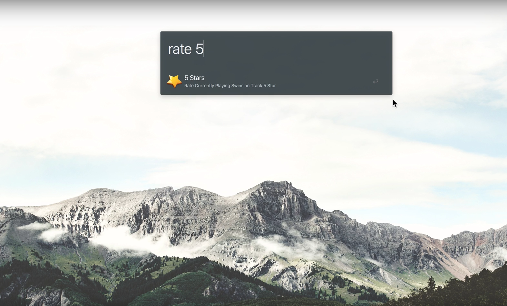

#Rate Swinsian Workflow (with iTunes rate added functionality)
### By Andrew Lee

## Install
Making sure you have Alfred 3 Powerpack installed, download "Rate Swinsian.alfredworkflow" double click on the file in finder, and click import.

The actual scripts are in /scripts/. (Although by themselves, they will not do anything)
They are just for people who are security counscious and need to understand the functionality before installing.

## What does this do
Heres the Demo

Basically, it uses the natively provided Swinsian Apple Scripts to set the rating based on the number you provide after the keyword "rate", then extact the track name, artist, and album information to activate in iTunes.

In iTunes, it will play the song using the information provided, set the rating, then stop all music.

## To modify the Workflow...
In order to keep it generally efficient, I have chosen not to include "activate" and "quit" iTunes since I noticed it actually makes the operation far less efficient if I needed to open and close iTunes every time I wanted to rate a song in Swinsian. But if this is something you want to encorporate, it is very easy to do.

Just edit the files Alfred Workflows, to activate then keystroke "m" to minimize iTunes before the song playing data. Then add a "quit iTunes" System call after its all over.

## Notes
Please note, this is definitely inefficient. The whole point of using Swinsian is to avoid the bloated iTunes interface. However, because I utilize iTunes match to sync my music accross my devices, and also because I have a capable machine that can keep up with this script, I have decided to upload this for anyone who is in a similar situation.

The whole bash script that sets the rating to the currently playing track in iTunes is more or less directly copied from dklem's [Alfred2-Rate-iTunes-Track](https://github.com/dklem/Alfred2-Rate-iTunes-Track).

I put in a request with the developers of Swinsian to add iTunes Library XML editing capabilities into Swinsian (since this is not theoretically a difficult process to have another application edit the metadata xml file, and since Swinsian can already read the data, it would not be any extra work to write the data)